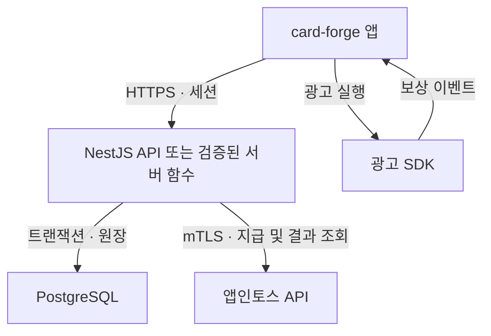

# Card Forge 서버 구성 추천

> 정리일: 2026-09-08  
> 기존 서버 추천과 Railway 비용, Supabase 전환, 광고 보상·토스 포인트 지급 논의를 통합했다. 요금은 USD 기준이며 세금·환율·추가 옵션은 별도다. 비용 예시는 실측 견적이 아니다.

## 1. 최종 방향

**현재는 기존 NestJS 서버를 유지하고 PostgreSQL을 연결하는 구성을 권장한다.** 한 곳에서 관리하려면 Railway API + Railway PostgreSQL, 초기 DB 비용을 줄이려면 Railway API + Supabase Free PostgreSQL을 선택한다.

**별도 상시 Node.js 서버는 없앨 수 있지만, 보상 지급을 검증하고 실행하는 서버 측 로직은 필요하다.** Supabase Edge Functions나 Cloudflare Workers도 이 역할을 하는 백엔드다. 따라서 “서버리스로 전환”은 백엔드 로직을 없애는 것이 아니라 실행 환경을 옮기는 것이다.

| 우선 목표 | 권장 구성 | 선택 조건 |
| --- | --- | --- |
| 기존 코드 활용·운영 단순화 | Railway NestJS + Railway PostgreSQL | API와 DB를 함께 관리하고 사용량 비용을 부담 |
| 기존 코드 유지·초기 비용 절감 | Railway NestJS + Supabase Free PostgreSQL | 무료 DB의 용량·휴면 조건과 외부 연결을 수용 |
| 상시 API 서버 비용 제거 | Supabase Edge Functions + PostgreSQL | 인증·보상·mTLS·재처리 로직의 이식과 검증 완료 |
| 무료 구간 중심으로 재설계 | Cloudflare Workers + D1 | 런타임과 PostgreSQL 저장소 계층 변경을 수용 |
| 짧은 외부 테스트 | Render Free API + 외부 PostgreSQL | 첫 요청 지연을 수용하고 실제 보상 지급은 분리 |

이 순위는 현재 프로젝트의 변경 비용까지 고려한 판단이다. 무료 요금제만 비교한 절대 순위는 아니다.

## 2. 현재 프로젝트와 필요한 역할

저장소의 [서버 README](../../apps/server/README.md)를 확인한 결과, `apps/server`에는 NestJS/PostgreSQL 기반 회원·세션 처리, Toss mTLS 검증, DB 마이그레이션과 카드팩 확률 정책이 있다. 서버가 발급하는 세션은 opaque token 방식이다.

기존 코드가 있다는 사실과 광고 검증·실제 토스 포인트 지급까지 운영 준비가 완료됐다는 것은 구분해야 한다. 이 문서는 서버 선택과 권장 설계를 정리하며 모든 기능의 구현 완료를 뜻하지 않는다.

| 기능 | 앱의 역할 | 신뢰할 수 있는 서버·DB의 역할 |
| --- | --- | --- |
| 사용자 정보 | 화면 표시·수정 요청 | 사용자 식별, 세션·권한 검증 |
| 카드 보관함 | 서버가 정한 순서대로 표시 | 소유권·보유량 관리 |
| 카드팩·강화 | 실행 요청·결과 연출 | 확률 계산, 비용 차감, 결과 저장 |
| 광고 보상 | 광고 실행·SDK 이벤트 전달 | 지급 자격·중복·한도·검증 근거 확인 |
| 재화·교환 | 잔액 조회·교환 요청 | 잔액 변경, 원장 기록, 동시 요청 제어 |
| 토스 포인트 | 지급 상태 표시 | 공식 API 호출, 지급 결과 조회·정합성 복구 |

### 카드 최대 5장 정책

보유 카드가 **5장 이상이면 추가 뽑기를 거절**한다. 동시 요청에서도 5장을 넘지 않도록 보유량 확인·비용 차감·카드 생성을 하나의 트랜잭션과 사용자 단위 잠금 등으로 보호한다.

DB에 오류로 5장을 초과한 데이터가 있어도 화면에는 정해진 순서의 앞 5장만 표시한다. 화면에서 숨기는 것과 서버에서 추가 발급을 차단하는 것은 별개다.

## 3. 전체 구성 비교

| 구성 | 비용 구조 | 기존 NestJS 활용 | DB·이식 부담 | 판단 |
| --- | --- | --- | --- | --- |
| Railway + Railway PostgreSQL | API·DB 리소스 합산, Hobby 최소 $5/월 | 높음 | PostgreSQL 유지 | 기본 운영안 |
| Railway + Supabase Free | Railway 요금 + 무료 한도 내 DB $0 | 높음 | 연결·권한·휴면 확인 | 비용 절감안 |
| Supabase 중심 | Free 한도 내 $0, Pro $25/월부터 | 함수 단위 재구성 | PostgreSQL 유지, 인증 이식 필요 | 검증 후 대안 |
| Workers + D1 | Free 한도 내 $0, Workers 유료 최소 $5/월 | 런타임 적응 필요 | D1은 SQLite 기반, SQL·잠금 재설계 | 변경 부담 큼 |
| Render Free + 외부 DB | 각 무료 한도 내 $0 | 높음 | API 휴면·재시작 지연 | 테스트용 |

가격 근거: [Railway](https://railway.com/pricing), [Supabase](https://supabase.com/pricing), [Workers](https://developers.cloudflare.com/workers/platform/pricing/), [Render Free](https://render.com/docs/free).

다른 후보는 다음과 같이 판단한다.

- **Neon:** 외부 PostgreSQL 후보로 남겨 둔다. 실제 채택 시 해당 시점의 무료 저장공간·컴퓨트·휴면 조건을 별도로 확인한다.
- **Firebase / MongoDB Atlas:** 이번 프로젝트는 PostgreSQL과 관계형 원장 구조를 이미 사용하므로, 단순히 무료 DB를 얻기 위해 데이터 모델을 바꾸는 것은 권장하지 않는다. Firebase 전체를 “PostgreSQL 미지원”으로 단정하기보다 비교 대상을 명확히 해야 한다.
- **VPS / EC2:** 일반 Node 서버와 DB를 직접 운영하는 대안이다. 요금 외에도 OS 패치, HTTPS, DB 백업, 장애 대응 시간을 비교한다. 사용자가 늘었다는 이유만으로 이전을 결정하지 않는다.

## 4. Railway 비용을 정확히 이해하기

### 기본 계산

Railway는 설정한 최대 사양을 한 달 내내 사용했다고 가정하는 고정 VM 요금과 다르다. **실제 CPU·메모리 사용량**을 기준으로 계산한다.

| 항목 | 공식 단가 |
| --- | ---: |
| CPU | $20 / vCPU·월 |
| RAM | $10 / GB·월 |
| Volume | $0.15 / GB·월 |
| 외부 송신 | $0.05 / GB |

월 환산 평균 사용량으로 다음과 같이 예산을 계산할 수 있다.

```text
U = 20 × 평균 CPU(vCPU)
  + 10 × 평균 RAM(GB)
  + 0.15 × 평균 Volume(GB)
  + 0.05 × 외부 송신량(GB)

Hobby 기본 청구액 = max(5, U)
Pro 기본 청구액   = max(20, U)
```

API와 DB가 모두 Railway에 있으면 두 서비스의 사용량을 합산한다. 크레딧은 서비스마다 중복 제공되는 것으로 계산하지 않는다. 위 식은 추가 옵션·세금·할인 등을 제외한 예산용 계산이다. [공식 단가·플랜](https://docs.railway.com/pricing/plans)

### 가정별 계산 예시

아래 수치는 API와 DB를 합친 월 환산 평균을 임의로 가정했다. 동시 사용자 수를 보장하는 사양표가 아니다.

| 가정 | 평균 CPU | 평균 RAM | Volume | 송신량 | 사용량 U | Hobby 청구 예시 |
| --- | ---: | ---: | ---: | ---: | ---: | ---: |
| 매우 낮은 부하 | 0.02 vCPU | 0.35 GB | 1 GB | 1 GB | $4.10 | $5.00 |
| 낮은 부하 | 0.05 vCPU | 0.75 GB | 1 GB | 5 GB | $8.90 | $8.90 |
| 지속적인 부하 | 0.20 vCPU | 1.00 GB | 5 GB | 10 GB | $15.25 | $15.25 |

“0.5 vCPU + 0.5 GB = $15”는 해당 사용량을 월 내내 실제 소비했다는 가정에서는 맞지만, 서버를 켰다는 이유만으로 항상 발생하는 최소 비용은 아니다.

사용량이 $15라면 Hobby 총액도 $15다. **$5 크레딧을 한 번 더 빼서 총 $10이라고 계산한 기존 설명은 잘못됐다.** API와 DB를 함께 쓴다는 이유만으로 Pro가 필수인 것도 아니다.

### Serverless와 비용 관리

Railway Serverless는 outbound traffic을 기준으로 비활동 상태를 판단한다. DB 통신·주기 작업 때문에 예상대로 잠들지 않을 수 있고, 깨어나는 첫 요청에는 지연이 생길 수 있다. 컴퓨트가 멈춰도 Volume과 플랜 최소액까지 모두 사라지는 것은 아니다. [Railway Serverless](https://docs.railway.com/deployments/serverless)

실제 보상 서비스는 응답 지연과 지급 재처리를 먼저 검증한다. 비용 알림·사용량 한도는 설정하되, 한도 도달 시 서비스가 중단되는지 확인한다. DB는 운영 연속성을 우선하며 “슬립하면 무조건 데이터가 유실된다” 또는 “DB는 최소 $15~25가 고정”이라고 단정하지 않는다.

## 5. Supabase는 어디까지 대체할 수 있나

### A. 기존 Node.js 서버 + Supabase DB

게임 로직과 Toss 연동은 NestJS에 유지하고 PostgreSQL만 Supabase에 둔다. Auth·Storage·Realtime을 모두 채택할 필요는 없다.

`DATABASE_URL` 변경 외에도 TLS, 네트워크 연결 방식, 커넥션 풀, DB 권한, 마이그레이션 호환성을 확인한다. 상시 서버와 서버리스 함수는 적합한 연결 방식이 다를 수 있다. [PostgreSQL 연결 가이드](https://supabase.com/docs/guides/database/connecting-to-postgres)

### B. Supabase Edge Functions + DB

회원 검증·보상 요청·외부 API 호출을 Edge Functions로 이식하면 별도 상시 Node.js 서비스를 없앨 수 있다. 다만 Edge Functions는 Deno 기반 TypeScript 환경이므로 기존 NestJS 프로세스를 그대로 올리는 배포 방식은 아니다. 실행 시간·메모리 제한과 재시도 설계를 함께 검토한다. [Edge Functions](https://supabase.com/docs/guides/functions), [실행 제한](https://supabase.com/docs/guides/functions/limits)

**현재 자료만으로 Supabase 호스팅 환경에서 Toss mTLS가 문제없이 동작한다고 확정할 수 없다.** 실제 인증서로 사용자 검증·지급 API 연결을 시험하고 인증서 보관·교체까지 확인한 뒤 전환한다. 이 검증이 완료되지 않으면 해당 로직은 기존 Node 서버에 유지한다.

### C. 앱에서 직접 DB 변경

Supabase SDK를 통한 접근은 Data API와 RLS를 거친다. 자기 프로필 같은 제한된 CRUD에는 사용할 수 있지만, 사용자가 자기 행을 수정할 수 있다는 정책만으로 잔액 조작이나 중복 보상이 막히지는 않는다.

- 잔액·카드 생성·지급 상태에 대한 클라이언트 직접 쓰기는 차단한다.
- 공개 가능한 키는 최소 권한과 RLS를 전제로 사용한다. `service_role` 같은 관리자 키는 앱에 넣지 않는다.
- 보상·교환·확률 로직은 서버 함수 또는 권한이 제한된 DB 함수에서 처리한다.
- 기존 opaque session은 Supabase JWT가 아니다. 기존 세션을 그대로 전달하면 RLS가 사용자로 인식한다고 가정하지 않는다. 인증 연동을 설계하거나 기존 API를 통해 접근한다.

RLS는 행 접근을 제어하는 수단이며 전체 게임 규칙을 자동으로 구현하지 않는다. [Supabase RLS](https://supabase.com/docs/guides/database/postgres/row-level-security)

### 무료 한도

| 항목 | Supabase Free |
| --- | ---: |
| DB 크기 | 500 MB |
| 파일 저장공간 | 1 GB |
| Edge Functions | 월 500,000회 |
| 활성 프로젝트 | 최대 2개 |
| 휴면 | 1주 비활동 시 일시 중지 |

기존 대화의 “Edge Functions 월 200만 회 무료”는 Free와 Pro를 혼동한 내용이다. **Free는 50만 회, Pro는 200만 회 포함**이다. [함수 요금](https://supabase.com/docs/guides/functions/pricing), [전체 요금·휴면 조건](https://supabase.com/pricing)

무료 인프라 한도와 토스 포인트 지급 재원은 별도다. 무료 플랜을 선택해도 보상 지급 비용까지 0원이 되는 것은 아니다.

## 6. Cloudflare Workers + D1

Workers는 요청 처리와 외부 API 연동, D1은 SQL 데이터 저장을 맡는다. 기존 PostgreSQL의 SQL·타입·트랜잭션·행 잠금 방식을 D1에서 그대로 사용할 수 있다고 가정하면 안 된다.

| 무료 항목 | 한도 |
| --- | ---: |
| Workers 요청 | 하루 100,000회 |
| Workers CPU | 호출당 10ms |
| D1 읽기 | 하루 5,000,000행 |
| D1 쓰기 | 하루 100,000행 |
| D1 저장공간 | 계정 전체 5 GB |

저장공간 총량 외 DB별 제한도 별도로 확인한다. **API 요청 수와 DB 처리 행 수는 다르다.** 1,000명이 하루 30회 호출하면 30,000요청이지만, 쿼리 스캔·여러 테이블 기록·인덱스 갱신에 따라 DB 한도는 먼저 소진될 수 있다. [Workers 요금](https://developers.cloudflare.com/workers/platform/pricing/), [D1 요금](https://developers.cloudflare.com/d1/platform/pricing/)

Cloudflare Workers는 외부 서비스에 클라이언트 인증서를 제시하는 **mTLS binding을 지원**한다. 기존 문서의 막연한 “지원 확인 필요”는 이 사실로 보완한다. 다만 Toss 인증서·API와의 실제 연결 검증은 필요하고, Node HTTPS Agent 코드를 그대로 쓰는 방식은 아니다. [Workers mTLS](https://developers.cloudflare.com/workers/runtime-apis/bindings/mtls/)

무료 구간은 매력적이지만 현재는 PostgreSQL과 NestJS를 함께 이식하는 비용이 크므로 후순위다.

## 7. “15분이면 사라지는 무료 서버” 정리

이 설명에 해당하는 대표적인 서비스는 Render Free 웹 서비스다. **15분 동안 요청이 없으면 웹 서비스가 잠들고**, 새 요청을 받으면 다시 시작한다. 공식 문서는 재시작에 약 1분이 걸릴 수 있다고 안내한다.

이는 DB가 15분 뒤 삭제된다는 뜻이 아니다. 별도로 **Render Free PostgreSQL은 생성 30일 뒤 만료**되고, 이후 업그레이드 유예기간이 지나면 삭제된다. 웹 서비스의 로컬 파일도 영구 DB 저장소로 사용하면 안 된다. [Render Free 조건](https://render.com/docs/free)

따라서 짧은 개발 테스트에는 쓸 수 있지만 실제 지급 요청을 계속 처리할 운영 기본안으로는 권장하지 않는다.

## 8. 광고 시청 → 게임 보상 → 토스 포인트 지급

사용자가 말한 “토스캐시”는 실제 연동할 상품을 확인해야 한다. 이 문서는 공식 **프로모션 토스 포인트 지급 API**를 기준으로 설명한다. Toss Payments 결제 승인과는 별도 연동이다. [프로모션 API](https://developers-apps-in-toss.toss.im/api/promotion)

### 권장 구조



Toss API를 호출하는 주체는 백엔드다. 기존 그림처럼 DB에서 Toss API로 직접 이어지는 구조가 아니다. mTLS 인증서와 개인키는 서버에서 관리한다. [서버 API 연동](https://developers-apps-in-toss.toss.im/documentation/integration/server-api)

### 광고 검증에서 확정한 것과 남은 것

공식 광고 SDK에는 `userEarnedReward` 이벤트가 있다. 광고 닫힘 이벤트만으로 보상 완료를 판단하지 않는다. 하지만 클라이언트 이벤트를 받았다는 사실과 서버가 검증 가능한 광고 시청 증명을 확보했다는 사실은 다르다. [광고 SDK](https://developers-apps-in-toss.toss.im/documentation/common/monetization/iaa/interstitial-rewarded-ad)

현재 확인한 자료만으로 이 통합 광고 경로에 사용 가능한 서버 검증 웹훅·SSV가 있다고 단정하지 않는다. 광고 제공자가 AdMob이라는 이유만으로 일반 AdMob의 서버 검증을 미니앱에서도 사용할 수 있다고 가정하지 않는다.

실제 적용 SDK와 광고 그룹의 검증 수단을 확인한 뒤 연동한다. 서버 검증이 제공되면 서명·이벤트 ID·사용자 연결을 검증한다. 그렇지 않으면 서버 발급 요청 ID, 세션, 횟수·시간·금액 제한 등으로 남은 위험을 관리하되, 이 조치만으로 실제 시청이 증명되거나 부정행위가 완전히 차단된다고 표현하지 않는다.

### 권장 지급 처리

아래는 구현 권장안이다.

1. 서버가 사용자와 연결된 보상 요청 ID를 만들고 만료 시간·지급 정책을 기록한다.
2. 앱은 광고 보상 이벤트를 서버에 전달하고, 서버는 지원되는 검증 근거와 사용자·중복·한도를 확인한다.
3. 게임 내 보상이 있다면 서버가 금액과 결과를 결정하고 보상 기록·잔액을 원자적으로 반영한다.
4. 포인트 교환 요청 시 잔액을 예약하고 지급 요청을 DB에 먼저 기록한다.
5. 지급 키를 저장한 뒤 Toss API를 호출하고, 공식 결과에 따라 성공을 확정한다.
6. 타임아웃처럼 결과가 불명확하면 결과 조회로 대조한다. 새 지급 키로 무작정 재지급하지 않는다.
7. 확정 실패에만 예약을 해제하고, 재처리 작업은 같은 요청을 중복 실행해도 한 번만 반영되게 만든다.

외부 API 호출과 DB 커밋은 하나의 DB 트랜잭션으로 묶이지 않는다. 따라서 “Toss 지급 성공 후 DB 기록 실패”를 복구할 지급 상태·원장·대조 작업이 필요하다. 테이블·상태명은 기존 스키마에 맞춰 정한다.

토스 포인트 지급 API에는 지급 키 생성, 지급 요청, 결과 조회 흐름이 있으므로 구현 시 최신 명세의 요청·오류 처리 규칙을 따른다. [프로모션 API 명세](https://developers-apps-in-toss.toss.im/api/promotion)

## 9. 실행 순서와 전환 기준

| 단계 | 할 일 | 완료 기준 |
| --- | --- | --- |
| 로컬 | NestJS + PostgreSQL 검증 | 마이그레이션·세션·카드팩 핵심 테스트 통과 |
| 외부 테스트 | Railway API + 선택한 PostgreSQL | HTTPS, DB 연결, 실제 mTLS 통신 성공 |
| 보상 연동 | 광고 검증 수단·포인트 지급 방식 확정 | 중복·동시 요청·타임아웃 후 대조 검증 |
| 출시 준비 | Secret, 백업·복원, 상태 확인, 비용 알림 | 인증서 교체·장애 복구·지급 한도 확인 |
| 운영 측정 | API·DB 비용과 응답 시간 관찰 | 실측값으로 DB 유료화·함수 이식 여부 판단 |

현재 서버 README의 빌드·마이그레이션 명령은 다음과 같다.

```bash
npm run server:build
npm run server:test
npm run db:migrate --workspace @card-forge/server
```

마이그레이션은 배포 전 단계에서 실행한다. 기존 문서는 인증서·개인키를 파일 경로로 읽으므로, 배포 환경에서도 Secret을 안전하게 파일로 제공하는 방식을 준비한다. 환경변수 이름과 검증 경로는 [서버 README](../../apps/server/README.md)를 따른다.

초기 선택은 **Railway + PostgreSQL 유지**다. DB 비용을 줄이려면 Supabase Free를 결합하고, 관리 단순화를 우선하면 Railway 내부 DB를 사용한다. Supabase Edge Functions 또는 Workers로의 전환은 무료라는 이유만으로 결정하지 않고, mTLS·인증·보상 복구 검증과 예상 절감액이 이식 비용을 정당화할 때 진행한다.
<<<<<<< HEAD

=======
>>>>>>> 9ff1661a9f4a5d715203431aa212a14b61a91fc1
